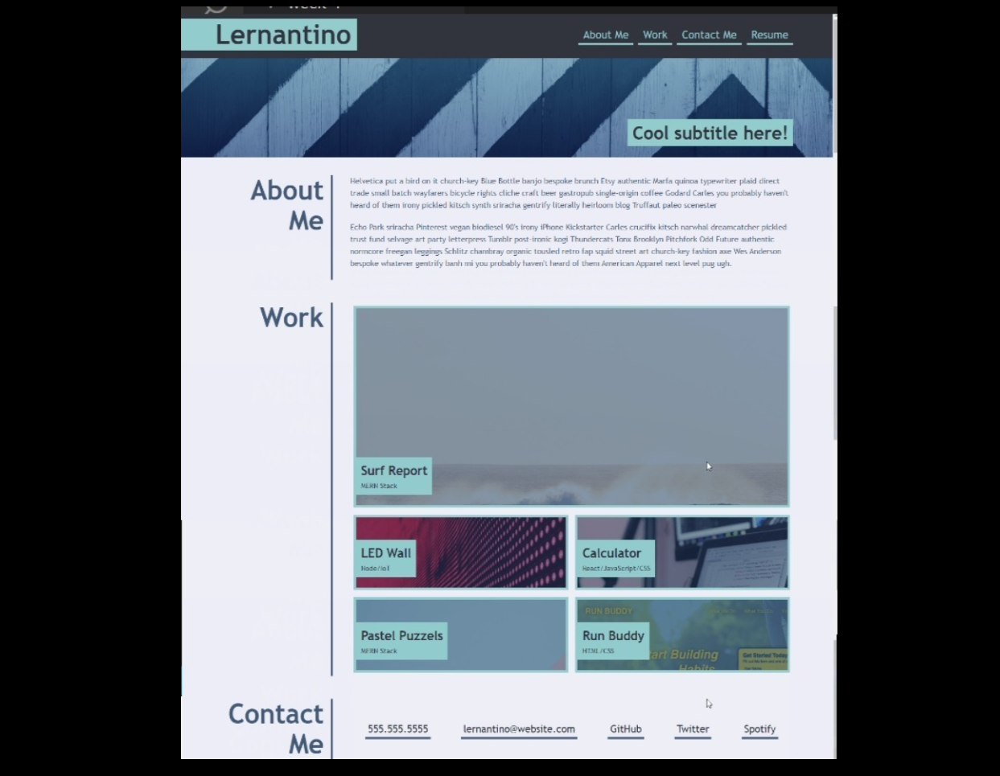

# My-portfolio-page
## Description
I created this project to build a portfolio of future projects.

This will help me show my projects to potential companies and recruiters and thus have more chances of finding a job.

This project has been created from the beginning from a photo (see below). 

 I have used HTML semantic elements and different css elements as well as css flex and grid.

I learned grid areas, flexbox and responsive websites.

##Usage

##Credtis

I used the following tutorialas:

https://css-tricks.com/snippets/css/a-guide-to-flexbox/
https://css-tricks.com/snippets/css/complete-guide-grid/
https://medium.com/@mchisti/two-css-tricks-thatll-make-your-site-fully-responsive-5f9efba4015e
https://www.youtube.com/watch?v=2KL-z9A56SQ&ab_channel=KevinPowell

